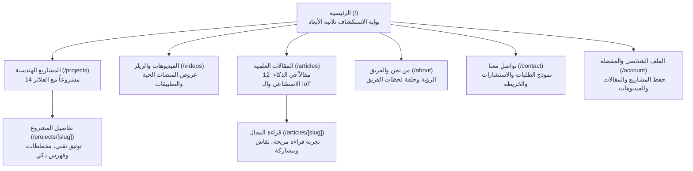

<div align="center">
  
  <h1>تكنو إنجاز · Techno Enjaz</h1>
  <p><strong>المنصة الرقمية والهندسية المتكاملة لمكتب تكنو إنجاز في حماة، سوريا</strong><br/>
  The Comprehensive Engineering & Innovation Platform for Techno Enjaz, Hama, Syria</p>

  <p>
    <a href="#ar">العربية (الدليل الشامل)</a> •
    <a href="#en">English (Overview)</a> •
    <a href="https://technoenjaz.com" target="_blank">الموقع الرسمي technoenjaz.com</a>
  </p>

  <p>
    
    
    
    
    
  </p>
</div>

---

<a id="ar"></a>

<div dir="rtl">

## 🌟 حول تكنو إنجاز (Vision & Essence)

**تكنو إنجاز** هو صرح هندسي واستشاري وتقني متقدم مقره مدينة حماة في الجمهورية العربية السورية. انطلق المكتب ليكون جسراً يربط بين التعليم الأكاديمي النظري والتطبيق الصناعي والتقني في مجالات الهندسة الحديثة:
- **الذكاء الاصطناعي والرؤية الحاسوبية (Artificial Intelligence & Computer Vision).**
- **الروبوتات والأنظمة المدمجة والمتحكمات الدقيقة (Robotics & Embedded Systems).**
- **إنترنت الأشياء والمدن الذكية والتحكم الصناعي (IoT & Industrial Automation).**
- **تطوير النظم البرمجية، المنصات السحابية، ومشاريع التخرج والبحث العلمي النوعية.**

هذا المستودع يمثل **الموقع الرسمي والمنصة الرقمية التفاعلية لتكنو إنجاز**؛ وهو مصمم وفق مفهوم **الهندسة السينمائية (Cinematic Engineering Web Experience)** الذي يدمج بين الفخامة البصرية، والمؤثرات ثلاثية الأبعاد الحية، والمحتوى العلمي والتقني الرصين.

---

## 🏛️ آلية وهيكلية الصفحات (Page Architecture & User Journey)

تم تصميم صفحات الموقع لتقديم تجربة تصفح متكاملة وسلسة تنقل الزائر من الاكتشاف البصري إلى المعرفة الهندسية الدقيقة:



### 1. الصفحة الرئيسية (`/` — The Interactive Gateway)
البوابة المركزية التي تبرز هوية المكتب وقدراته من خلال عدة أقسام تفاعلية سينمائية:
- **واجهة الهيرو التفاعلية (Hero Section & ScrollExpand):** مدخل بصري يعتمد تقنية التمدد البصري مع التمرير، يتكيف تلقائياً بين الوضعين الداكن والفاتح، ويبرز شعار المكتب وعنوانه الاستراتيجي.
- **لولب المشاريع ثلاثي الأبعاد (3D InfiniteSpiral):** لولب دوراني ثلاثي الأبعاد يعرض نماذج من مشاريع المكتب، يدعم التدوير التلقائي والسحب باللمس، ويتكيف مقاسه ديناميكياً ليناسب شاشات الهواتف الضيقة دون أي خروج عن حدود الشاشة.
- **سينما الفيديوهات التفاعلية (CardSwap Video Deck):** حزمة بطاقات ثلاثية الأبعاد تتبادل بسلاسة وتتيح تشغيل الفيديوهات والشروحات الهندسية مباشرة عبر مشغل مدمج، مع إمكانية حفظ الفيديوهات في المفضلة المحلية.
- **شبكة المقالات التفاعلية (MagicBento Grid):** شبكة بنتو متطورة بتأثير الوهج الضوئي (Mouse/Touch Spotlight Glow) تعكس أحدث الأوراق والمقالات العلمية المنشورة.
- **فوتر سينمائي (Cinematic Footer):** شريط إخباري متحرك، وشعار هندسي عملاق متدرج، وروابط وصول سريعة، مع مراعاة كاملة لحواف الأمان السفلية للأجهزة الذكية.

---

### 2. كتالوج المشاريع الهندسية (`/projects` و `/projects/[slug]`)
معرض متخصص يوثق **14 مشروعاً هندسياً وتقنياً متقدماً** تم إنجازها بإشراف ودعم المكتب:
- **نظام الفلاتر الفوري:** إمكانية تصفية المشاريع حسب الاختصاص (ذكاء اصطناعي، إنترنت أشياء، روبوتات وأنظمة تحكم، منصات برمجية وسحابية).
- **صفحات التفاصيل الفردية (`[slug]`):** 
  - توثيق علمي يشرح المشكلة الهندسية، الحل المبتكر، العتاد والبرمجيات المستخدمة.
  - جدول محتويات تفاعلي (`TableOfContents`) يتيح القفز بين العناوين بسهولة.
  - معرض صور عالي الدقة ولقطات توضيحية.
  - ميزة حفظ المشروع في المفضلة الشخصية، وزر للرجوع السلس لكافة المشاريع.

---

### 3. المنصات الحية والفيديوهات (`/videos`)
مكتبة مرئية حديثة تعرض نماذج المشاريع والأنظمة الحية بصيغة بطاقات وريلز مرئية:
- مشغل فيديو داخلي منبثق (`VideoPlayerModal`) يتيح المشاهدة دون مغادرة المنصة، مع روابط مباشرة للمشاهدة الخارجية.
- علامات تصنيف دقيقة لكل فيديو، وتوضيح لدور المهندس المسؤول، ونظام حفظ سريع للمكتبة المفضلة.

---

### 4. المكتبة والمقالات العلمية (`/articles` و `/articles/[slug]`)
مرجع معرفي وتقني مجاني يضم **12 مقالاً تخصصياً عميقاً** باللغة العربية:
- تغطية شاملة لأحدث مفاهيم التقنية العالمية: *بروتوكول سياق النموذج (MCP)*، *التنبؤ بالرمز التالي في النماذج اللغوية (Next Token Prediction)*، *الحوسبة العاطفية (Affective Computing)*، *التوأم الرقمي (Digital Twin)*، *بنية راديو 5G NR*، و*أنظمة الركوب التشاركي الذكي*.
- تجربة قراءة فائقة الراحة (Distraction-Free Reader) مع تقدير زمن القراءة، وتنسيق أنيق للأكواد والمصطلحات الإنجليزية دون كسر التخطيط العربي، وقسم تفاعلي للمناقشة وإبداء الآراء.

---

### 5. من نحن وفريق العمل (`/about` و `/team/[id]`)
- التعريف برؤية المكتب، تاريخه، والرسالة الهندسية التي يسعى لنشرها.
- **حلقة لحظات الفريق ثلاثية الأبعاد (`TeamMomentsRing`):** عنصر رسومي تفاعلي يعرض صور ولحظات فريق العمل ضمن حلقة تدور في الفضاء الثلاثي الأبعاد.
- بطاقات تعريفية مفصلة بأعضاء الفريق الهندسي ومجالات اختصاصهم.

---

### 6. التواصل والطلبات والاستشارات (`/contact`)
- واجهة تواصل حديثة مزودة بحقول إدخال مقوسة (`CurvedInput`) مصممة خصيصاً للهوية.
- إمكانية إرسال تفاصيل مشاريع التخرج أو الاستشارات التقنية، مع روابط مباشرة للتواصل عبر واتساب، الهاتف، والبريد الإلكتروني، وخريطة تفاعلية لمقر المكتب في حماة.

---

### 7. الأسئلة الشائعة (`/faq`)
دليل شامل يغطي أكثر من 13 استفساراً محورياً يتعلق بآلية العمل، تنفيذ الدوائر الإلكترونية، تسليم الأكواد، الاستشارات الميدانية، ودعم الطلاب والمهندسين.

---

### 8. الحساب والمكتبة الشخصية (`/account`, `/login`, `/register`)
- نظام ملف شخصي محلي تجريبي فائق الخفة (بدون تعقيدات قواعد البيانات الخارجية)، يتيح للزائر إنشاء حسابه، واختيار صورته، وإدارة مكتبته الشخصية من المشاريع والمقالات والفيديوهات المحفوظة في مكان واحد.

---

## 📱 التصميم المتجاوب والمتكيف لجميع الأجهزة (Responsive & Adaptive)

تم بناء الموقع ليعمل بذكاء على كل مقاسات الشاشات العالمية:

```text
┌─────────────────┬──────────────────────┬────────────────────────────────────────────────────────┐
│ تصنيف الأجهزة   │ نطاق الشاشة (Viewport)│ السلوك المعماري للموقع                                 │
├─────────────────┼──────────────────────┼────────────────────────────────────────────────────────┤
│ هواتف صغيرة     │ 320px – 480px        │ قائمة درج زجاجية، تحجيم لولب المشاريع وبطاقات الفيديو، │
│ ومطوية مغلقة    │ (Redmi, iPhone SE)   │ نصوص لا تقل عن 12px، أهداف لمس مريحة (44-48px)         │
├─────────────────┼──────────────────────┼────────────────────────────────────────────────────────┤
│ هواتف قياسية    │ 480px – 768px        │ هيدر مدمج، توزيع ديناميكي للمحتوى، أمان الحواف         │
│ ورائدة          │ (iPhone 16, S24)     │ (Safe Area Insets للـ Dynamic Island وأشرطة الإيماءات) │
├─────────────────┼──────────────────────┼────────────────────────────────────────────────────────┤
│ أجهزة لوحية     │ 768px – 1024px       │ شبكات ثنائية الأعمدة للمقالات، مساحات واسعة للقراءة،   │
│ (Tablets / iPad)│ (iPad Air / Mini)    │ تنقل هجين مرن وسريع                                    │
├─────────────────┼──────────────────────┼────────────────────────────────────────────────────────┤
│ حواسيب مكتبية   │ 1024px – 1920px      │ النسخة الأصلية الكاملة: قائمة GooeyNav السائلة، شبكات  │
│ ولابتوب         │ (MacBook, Desktop)   │ بنتو رباعية، مؤثرات WebGL ثلاثية الأبعاد بأعلى جودة    │
├─────────────────┼──────────────────────┼────────────────────────────────────────────────────────┤
│ شاشات التلفزيون │ 1920px – 3840px+     │ تحديد أقصى عرض للحاوية (1440px) لمنع تمدد الأسطر       │
│ والـ Ultra-Wide │ (4K TVs, 21:9 Wides) │ وتوسيط المحتوى هندسياً لتحقيق تجربة مشاهدة مريحة       │
└─────────────────┴──────────────────────┴────────────────────────────────────────────────────────┘
```

### مزايا الواجهة الخاصة بالهواتف (Mobile UX Innovations):
1. **قائمة الدرج الزجاجية الذكية (`MobileNavDrawer`):** تنزلق بنعومة من جانب الشاشة، وتعرض جميع الروابط بأيقونات واضحة ومساحات لمس واسعة تلائم حجم الإبهام.
2. **عزل تأثيرات الـ Hover:** حصر تأثيرات التحويم داخل استعلام `@media (hover: hover)` لحماية مستخدمي اللمس من ظاهرة تعليق الأزرار (Sticky Hover).
3. **الحركات ثلاثية الأبعاد التكيفية:** لولب المشاريع وحزم بطاقات الفيديو تعيد ضبط أقطارها وحجومها تلقائياً حسب عرض الشاشة، لتبقى الحركات والانتقالات الجذابة حاضرة حتى على الهواتف المدمجة.

---

## 🎨 الهوية البصرية وتجربة المستخدم (Visual Identity & Theme)

- **ثنائية اللغة الكاملة:** دعم لغوي شامل للغتين العربية (RTL) والإنجليزية (LTR)، مع خط **Readex Pro** الحديث لضمان أعلى مستويات القراءة والجمالية.
- **نظام المظهر المزدوج (Dark & Light Mode):**
  - **الوضع الليلي (Dark Mode):** أسود فضائي سينمائي (`#030508`) مع لمسات نيون باللونين الأزرق السماوي (`#00d2ff`) والبنفسجي، مع تدرجات زجاجية فخمة.
  - **الوضع النهاري (Light Mode):** أبيض نقي مع خلفيات رمادية ثلجية مريحة للعين، وتباين فائق للنصوص والعناصر وفق معايير الوصول العالمية.
- **محركات الأداء البصري:** استخدام مدروس لمكتبات الحركة والرسوميات (GSAP, Framer Motion, Canvas 2D) لتقديم انتقالات سلسة بمعدل 60 إطاراً في الثانية.

---

## ⚡ البنية التقنية ومعمارية الأداء (Technical Architecture)

```text
Build Time:
  src/content/*.md (Markdown مقالات ومشاريع) + src/data/*.ts (بيانات وصفية)
        ↓ Next.js App Router (Server Components & SSG Generation)
  49 صفحة ثابتة HTML فائقة السرعة مع بيانات منظمة JSON-LD كاملة
        ↓
Runtime:
  تحميل فوري للصفحات كـ Static HTML (لا حاجة لانتظار جافاسكريبت لقراءة المحتوى)
        ↓
Client Hydration:
  تفعيل الأجزاء التفاعلية فقط (المؤثرات ثلاثية الأبعاد، الدرج، الفلاتر، تبديل المظهر واللغة)
```

- **توليد ثابت كامل (100% SSG):** كافة صفحات الموقع العامة جاهزة ومبنية مسبقاً، مما يمنح سرعة تحميل خارقة وتجربة مستخدم خالية من أي وميض أو تأخير.
- **جاهزية النشر السحابي:** توافق كامل مع بيئة **Cloudflare Workers** عبر حزمة `@opennextjs/cloudflare`، واستعداد لتخزين الـ Cache عبر R2 و D1.
- **أرشفة ذكية ومتوافقة مع الذكاء الاصطناعي (SEO & AI Optimization):**
  - بيانات منظمة JSON-LD تغطي كيان المنظمة، المقالات (`BlogPosting`)، والمشاريع (`CreativeWork`).
  - خرائط موقع محدثة (`sitemap.xml`)، وملف توجيه العناكب (`robots.txt`).
  - ملفات استدلال متخصصة لنماذج الذكاء الاصطناعي ومحركات الإجابة الحديثة (`llms.txt` و `llms-full.txt`).
  - حماية الروابط القديمة من الكسر عبر نظام إعادة توجيه ذكي للمسارات السابقة (`#article/...`).

---

## 💻 التشغيل المحلي والتطوير (Local Setup)

### المتطلبات الأساسية
- **Node.js** (الإصدار 20 أو أحدث موصى به).
- **npm** أو **pnpm**.

### خطوات التشغيل
1. استنساخ المستودع والدخول للمجلد:
   ```bash
   git clone https://github.com/Daliaalkilani/technoinjaz.git
   cd technoinjaz
   ```
2. تثبيت الحزم والاعتماديات:
   ```bash
   npm install
   ```
3. تشغيل خادم التطوير المحلي:
   ```bash
   npm run dev
   ```
   افتح المتصفح على: `http://localhost:3000`

4. بناء نسخة الإنتاج والتحقق من الأنواع:
   ```bash
   npm run build
   ```

---

## 📞 قنوات التواصل الرسمية (Connect with Techno Enjaz)

- **الهاتف والواتساب المباشر:** `+963 958 794 195`
- **البريد الإلكتروني:** `info@technoenjaz.com`
- **إنستغرام الرسمي:** [@TECHNO_ENJAZ](https://instagram.com/TECHNO_ENJAZ)
- **المقر والموقع:** حماة، الجمهورية العربية السورية

---

<div align="center">
  <p>© 2026 تكنو إنجاز · جميع الحقوق محفوظة · Techno Enjaz All Rights Reserved</p>
</div>

</div>

---

<a id="en"></a>

## 🌐 English Overview

### About Techno Enjaz
**Techno Enjaz** is a leading engineering and technological consultancy office based in Hama, Syria. It specializes in delivering real-world industrial and graduation projects across:
- **Artificial Intelligence & Computer Vision.**
- **Robotics, Microcontrollers & Embedded Systems.**
- **Internet of Things (IoT) & Smart Control Systems.**
- **Modern Cloud Applications, Platforms, and Applied Engineering Research.**

This repository hosts the **official platform of Techno Enjaz**, crafted with a **Cinematic Engineering** aesthetic that pairs cutting-edge 3D micro-interactions with rich, authoritative technical content.

### Core Highlights
1. **Interactive Experience:** 3D Infinite Spiral project showcase, interactive 3D CardSwap cinema feed, and MagicBento spotlight grids.
2. **Comprehensive Knowledge Base:** 12 in-depth original technical articles and 14 detailed engineering projects with full architectural documentation.
3. **Adaptive Across All Devices:** Fully tailored for mobile screens (Apple iPhones with Dynamic Island, Android/Xiaomi/Redmi devices, Foldables), tablets, laptops, and ultra-wide / Smart TV displays.
4. **Bilingual & Dual Theme:** Seamless Arabic (RTL) and English (LTR) support with meticulously calibrated Dark and Light modes.
5. **Next.js 15 & Static Generation:** High-performance static site generation (SSG) with full JSON-LD structured data and AI-ready endpoints (`llms.txt`).

---

<div align="center">
  <sub>Built with passion and engineering excellence for Techno Enjaz.</sub>
</div>
